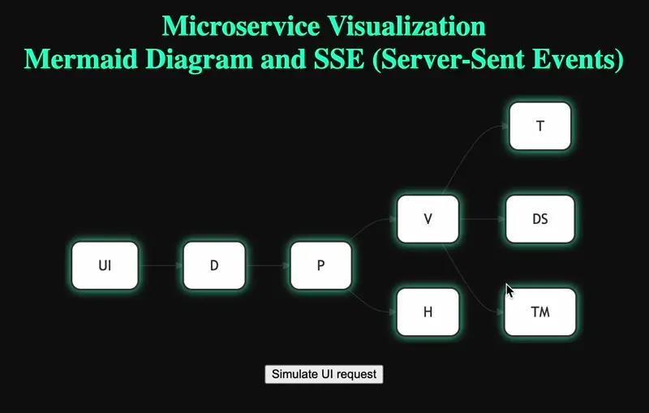

# SSE (Server Sent Events) example

This project demonstrates the visualization of a microservice architecture using `Mermaid` diagrams and `Server-Sent Events (SSE)` for real-time updates. The application consists of two main components: a Flask-based microservice (app.py) and a web application (web.py) that renders the `Mermaid` diagram and handles real-time updates.

## Overview

The application simulates a microservice architecture where each service can be activated, and its status is reflected in real-time on a Mermaid diagram. The diagram is updated using SSE, enabling dynamic visualization of microservice interactions.

## Demo

### Interaction Diagram

The interaction between the application components can be represented by the following diagram:

- `app.py`: The microservice that handles activation requests and interacts with other services.

- `web.py`: The web application that manages the diagram state and sends updates via SSE.

- `index.html`: The frontend that displays the Mermaid diagram and interacts with the microservice through the web application.


### Preview



## How It Works

### Microservice (app.py)

- Activation Endpoint: The /activate endpoint handles requests to activate a service. If no services are specified, it can randomly return a success (200) or error (500, 502) status. If services are specified, it forwards the activation request to those services and aggregates their responses.

- Service Communication: The microservice communicates with other services by sending HTTP POST requests to their /activate endpoints. It uses threading to handle multiple service requests concurrently.

- Web Communication: The microservice sends color updates to the web application (web.py) to reflect the status of the service (e.g., green for success, red for failure).

### Web Application (web.py)

- Diagram Rendering: The web application renders a Mermaid diagram representing the microservice architecture. The diagram is updated in real-time using SSE.

- SSE Endpoint: The /events endpoint establishes an SSE connection with the client, allowing the server to push updates to the client whenever the diagram state changes.

- State Management: The diagram_state dictionary tracks the current color of each node in the diagram. The /activate endpoint updates this state and notifies all connected clients.

### Frontend (index.html)

- Mermaid Diagram: The frontend uses the Mermaid library to render the diagram. The diagram is styled with a neon theme for enhanced visual appeal.

- SSE Integration: The frontend establishes an SSE connection to the /events endpoint and updates the diagram upon receiving a state change notification.

- Activation Controls: The frontend provides a simple interface to activate a specific node in the diagram with a chosen color.

## Technologies Used

- Flask: A lightweight web framework for Python, used to build the microservice and web application.

- Mermaid: A JavaScript library for rendering diagrams and flowcharts.

- Server-Sent Events (SSE): A server push technology that allows the server to send real-time updates to the client.

- Requests: A Python library for making HTTP requests, used for inter-service communication.

## Conclusion

This project provides a simple yet powerful visualization of a microservice architecture using Mermaid diagrams and real-time updates via SSE. It demonstrates how to build and interact with microservices while offering an interactive and visually appealing user interface.

## Usage

### Install dependencies

1. Clone the Repository:

    ```bash
    git clone https://github.com/ehles/microservice_sample.git
    cd microservice_sample
    ```

2. Install dependencies

    ```bash
    pip install -r requirements.txt
    ```

3. Run the Web Application

    ```bash
    python web.py
    ```

4. Open http://localhost:5000 in your browser
5. Run the Microservices

    ```bash
    python ./app.py -l 5010 -n T -t 1000 &
    python ./app.py -l 5011 -n DS -t 800 &
    python ./app.py -l 5012 -n TM -t 1500 &
    python ./app.py -l 5013 -n V -t 4000 -s 127.0.0.1:5010 -s 127.0.0.1:5011 -s 127.0.0.1:5012 &
    python ./app.py -l 5014 -n P -t 4000 -s 127.0.0.1:5013 -s 127.0.0.1:5017 &
    python ./app.py -l 5017 -n H -t 1000 &
    python ./app.py -l 5015 -n D -t 4000 -s 127.0.0.1:5014 &
    python ./app.py -l 5016 -n UI -t 4000 -s 127.0.0.1:5015 &
    ```

6. Send requests to the micro services

    ```bash
    curl -X POST http://localhost:5016/activate -H "Content-Type: application/json" -d '{"item": "V", "color": "red"}'
    ```
